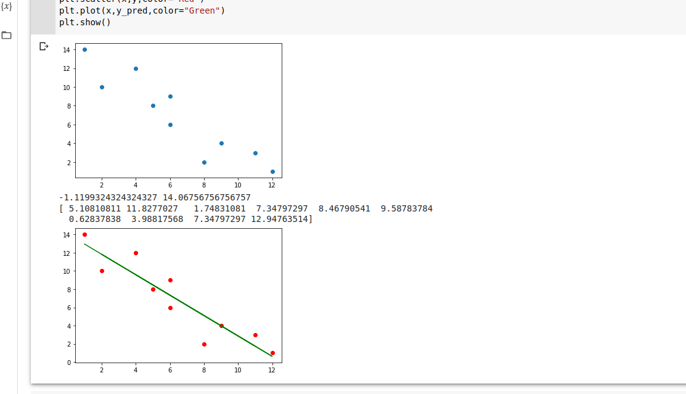
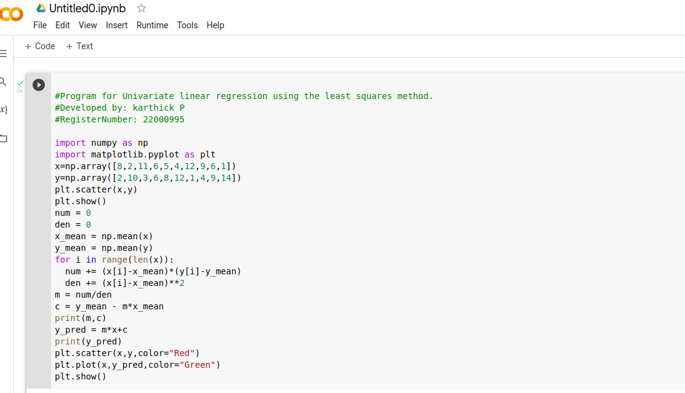

# Implementation of Univariate Linear Regression
## Aim:
To implement univariate Linear Regression to fit a straight line using least squares.
## Equipment’s required:
1.	Hardware – PCs
2.	Anaconda – Python 3.7 Installation / Moodle-Code Runner
## Algorithm:
1.	Get the independent variable X and dependent variable Y.
2.	Calculate the mean of the X -values and the mean of the Y -values.
3.	Find the slope m of the line of best fit using the formula.
 
4.	Compute the y -intercept of the line by using the formula:
  
5.	Use the slope m and the y -intercept to form the equation of the line.
6.	Obtain the straight line equation Y=mX+b and plot the scatterplot.
## Program
```


#Program for Univariate linear regression using the least squares method.
#Developed by: karthick P
#RegisterNumber: 22000995

import numpy as np
import matplotlib.pyplot as plt
x=np.array([8,2,11,6,5,4,12,9,6,1])
y=np.array([2,10,3,6,8,12,1,4,9,14])
plt.scatter(x,y)
plt.show()
num = 0
den = 0
x_mean = np.mean(x)
y_mean = np.mean(y)
for i in range(len(x)):
  num += (x[i]-x_mean)*(y[i]-y_mean)
  den += (x[i]-x_mean)**2
m = num/den
c = y_mean - m*x_mean
print(m,c)
y_pred = m*x+c
print(y_pred)
plt.scatter(x,y,color="Red")
plt.plot(x,y_pred,color="Green")
plt.show()


```
## Output





## Result
Thus the univariate Linear Regression was implemented to fit a straight line using least squares.
